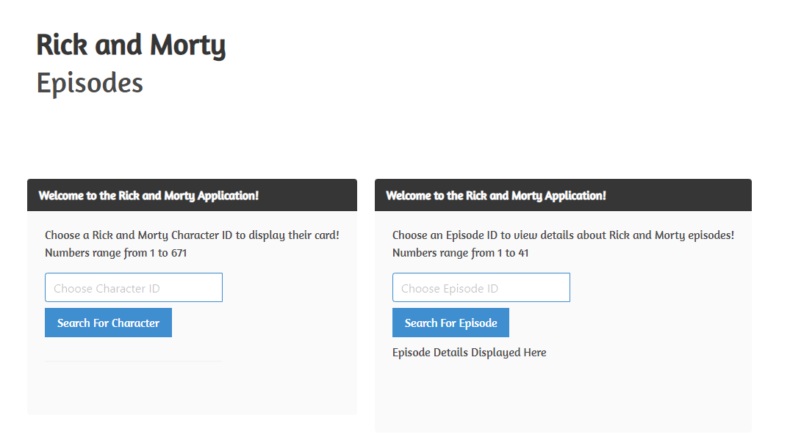
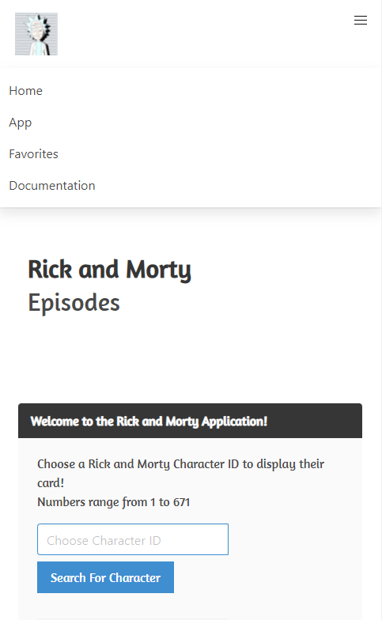

## Welcome to my Portfolio!
# By Philip Kalinowski

The first project is a Rick and Morty card application where the user can choose some of their favorite characters (and tv episodes). The user can then check the Favorites tab to see what has been saved. Since this application uses localstorage, the cards can be saved when the user refreshes the page.

The images below show a preview of what the application looks like, not only on a desktop format yet also for a mobile application.

Furthermore, I have shared some screenshots of local-storage use with a key to store multiple selections. Ideally, there will be a different key for each user. In the event of this being a full-application for someone's favorite characters, there will also be a profile page separate from the local-storage favorites page. In this case, users can look at recent favorites from other users on the same application. Such as, a trending option.

[Rick and Morty Card Application](https://people.rit.edu/pak5559/projects/Project2/app.html)

