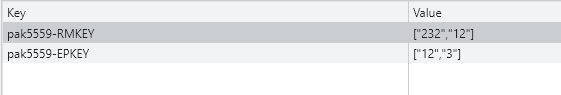
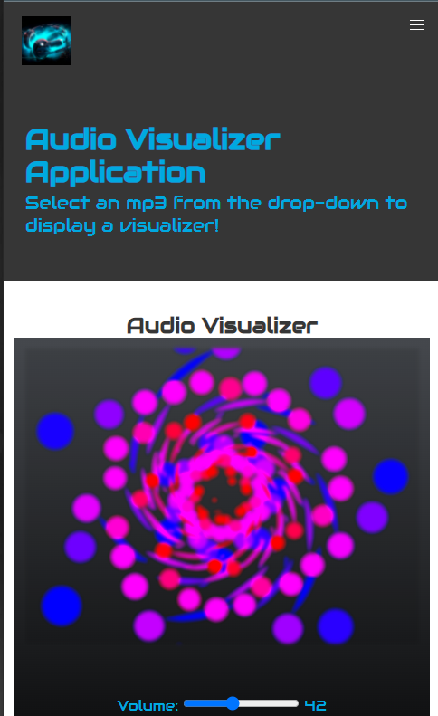

## Welcome to my Portfolio!
# By Philip Kalinowski

Two Projects: 
[Web Audio API Visualizer with Canvas](https://people.rit.edu/pak5559/projects/FinalProject/app.html)
[Rick and Morty Card Application](https://people.rit.edu/pak5559/projects/Project2/app.html)

The first project is a Rick and Morty card application where the user can choose some of their favorite characters (and tv episodes). The user can then check the Favorites tab to see what has been saved. Since this application uses localstorage, the cards can be saved when the user refreshes the page.

The images below show a preview of what the application looks like, not only on a desktop format yet also for a mobile application.

Furthermore, I have shared some screenshots of local-storage use with a key to store multiple selections. Ideally, there will be a different key for each user. In the event of this being a full-application for someone's favorite characters, there will also be a profile page separate from the local-storage favorites page. In this case, users can look at recent favorites from other users on the same application. Such as; a trending option.

Note: This uses the Rick and Morty API

## The mobile version above was utilised through the Bulma CSS framework.

## Local storage which shows user-saved favorites

[Rick and Morty Card Application](https://people.rit.edu/pak5559/projects/Project2/app.html)

The second project is an Audio Visualizer application where the user can watch a visualizers through particular mp3 files. To further this project, an idea I had is to include a file-event system which resets the canvas once a user uploads a file. Below are some screenshots regarding this project file's completion. The Web Audio API was my main source of data. 

[Web Audio API Visualizer with Canvas](https://people.rit.edu/pak5559/projects/FinalProject/app.html)

The application is also available in a mobile format as well!

There are set controls as well for this application. The first few choices are for the visualizer itself and the other options are options/modifiers for the app.

The last image shows a full-screen adaptation to the visualizer.

As you can see, there are only a couple choices here as I showcase my work. However, more projects are on the way (such as through the use of NodeJS) this semester!
Thank you for checking out my work!

